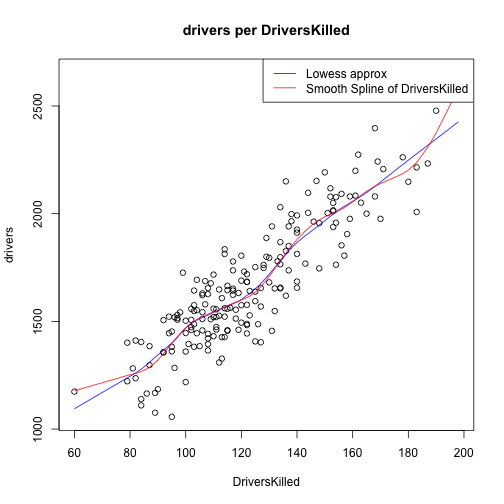

London Car Safety Pitch
========================================================
author: Thomas Sacchetti
date: 8/20/15

Overview
========================================================

The app is designed to help students not only develop a better understanding
 intuition of the following categories.

- Relative approximations from the the Smooth Spline vs. the Lowess
- General trends in information
- The effects of changing the fit coefecient in the Lowess model

Why this app
========================================================
This app allows students to gain an interactive experience but distinguishes itself because it is:

- Interactive
- Intuitive
- Allows Students to gain insight in statistical modeling

Example Plot
========================================================

 
